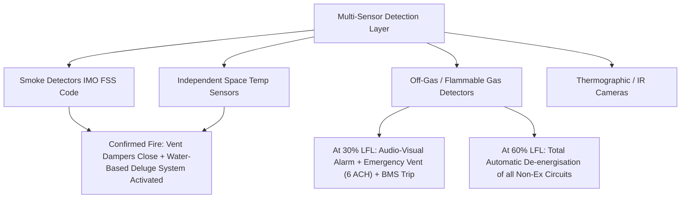

# VFCPL-MEP-001 (Project SAMUDRA) AMBESS
## Marine BESS Compliance & Gap Analysis: American Standards (ABS ESS-LiBATTERY) vs. Indian Register of Shipping (IRS)
### Incorporating the Comprehensive Technical Framework from "Marine BESS.docx"

---

### Slide 1: Title, Executive Strategy & Project Identity

#### Metadata & Ownership Structure
* **System Integrator & Approval Applicant:** VFCPL (Vayusakti Future Construct Pvt. Ltd.)
* **Battery & BMS OEM Partner:** Clean Electric (Pvt. Ltd.)
* **Platform Designation:** VFCPL-MEP-001 (Project SAMUDRA / AMBESS - Anchor Mode BESS)
* **Core Technology:** Direct-Contact Dielectric Immersion-Cooled BESS (LFP Prismatic Cells, Closed Hydraulic Circulation Loop, Sealed Aluminum Tank)
* **Domestic Regulatory Baseline:** Indian Register of Shipping (IRS)
  * *Approval of Lithium-ion Battery Systems* (Classification Note CN Rev.1, Mar 2026)
  * *Guidelines on Battery Powered Vessels* (GL Rev.2, Mar 2026)
  * *Electrical Equipment, Control, Protection, Safety and Environmental Requirements* (13a-CN, Mar 2025)
* **Target American Regulatory Baseline:** American Bureau of Shipping (ABS)
  * *Requirements for Use of Lithium-ion Batteries in the Marine and Offshore Industries* (Updated Dec 2025)
  * Vessel Notation: **`ESS-LiBATTERY`** (ABS *Notations and Symbols Table*, Jan 2026, p. 59)
  * US Statutory Reference: USCG NVIC 02-19 (*Design Guidance for Lithium-ion Battery Systems*) & 46 CFR Subchapter J

#### Executive Decision for Your Company (from Section 1 of Research Dossier)
1. **Primary Route:** Pursue the **IRS battery-system product approval** route as the core contractual baseline for India-based projects.
2. **ABS Dual-Track Checklist:** Utilize the **ABS Dec 2025 Guide** as a second engineering and evidence checklist to ensure the BESS can be supplied to ABS-classed and US-regulated vessels without mechanical, electrical, or software redesign.
3. **Notation Scope Clarity:** **`ESS-LiBATTERY`** is a class notation assigned to an operational marine asset (vessel/rig) with a compliant installed battery system. Avoid marketing a raw battery pack or container as "holding the ESS-LiBATTERY notation." The product goal is an **ABS Type Approval (PDA + MA)** that an integrator and shipyard can seamlessly credit towards the vessel's notation.
4. **Harmonized Test Evidence:** Agree with IRS and ABS on shared laboratory test evidence before commissioning expensive, destructive testing (e.g. thermal propagation, shock, vibration).

---

### Slide 2: Scope, Thresholds & Regulatory Hierarchy

#### Detailed Comparison Table
| Parameter | American Standard (ABS Dec 2025 Guide) | Indian Standard (IRS CN Rev.1 / GL Rev.2 Mar 2026) | VFCPL-MEP-001 Implementation | Compliance Verdict |
| :--- | :--- | :--- | :--- | :--- |
| **Mandatory Capacity Threshold** | **$\ge$20 kWh** (Threshold lowered from 25 kWh in April 2024; confirmed Dec 2025). Mandatory application of ABS Part 4, Ch 8 and Battery Guide. | Mandatory for all lithium-ion systems intended for propulsion or essential services; no minimum kWh lower cutoff. | Pack and multi-rack configurations are modular, designed for commercial marine deployment **> 20 kWh**. | **COMPLIANT**; falls squarely within the ABS mandatory regime. |
| **Small Systems Clause** | **2 to <20 kWh (Section 1/3.1):** Specific simplified requirements for systems located in control stations. Not a blanket exemption. | Handled on plan approval case-by-case; basic IEC 62619 safety compliance required. | Not applicable; MEP-001 is a full industrial energy platform. | **NOTED**; MEP-001 addresses the comprehensive $\ge$20 kWh requirements. |
| **Class Notation Assignment** | **`ESS-LiBATTERY`** (ABS Jan 2026 p.59). Optional vessel notation verifying compliant installed battery system. | **`BATTERY PROP`** (Main Propulsion) or **`BATTERY (PROPULSION SUPPORT)`** (Hybrid/Auxiliary). | AMBESS supplies hotel/auxiliary anchor loads. Not main propulsion. | **ALIGNED**: Qualifies for ABS `ESS-LiBATTERY` and IRS `BATTERY (PROPULSION SUPPORT)`. |
| **Statutory US Framework** | **USCG NVIC 02-19**; 46 CFR Subchapter J (Electrical Engineering); NFPA 855. | DG Shipping (India) Merchant Shipping Rules; IMO MSC.1/Circ.1453 & Circ.1647. | Architecture adheres to IMO life-safety fundamentals. | **ACTION REQUIRED**: NVIC 02-19 requires failure modes and thermal propagation reports submitted to USCG MSC. |

---

### Slide 3: Certification Pathway & Scope Boundaries (PDA, MA, TA, Unit Cert)

#### ABS vs. IRS Certification Structure
```
[Level 1: Design Review]
  ├── ABS: Product Design Assessment (PDA) - 5 Years Validity
  └── IRS: Type Approval Drawing & Plan Assessment - 5 Years Validity
[Level 2: Factory Quality & Works Assessment]
  ├── ABS: Manufacturing Assessment (MA) - Annual Plant Surveillance Audits
  └── IRS: Manufacturer Works Assessment - Intermediate Audits <= 30 Months
[Level 3: General Product Type Approval]
  ├── ABS: ABS Type Approval = PDA + MA combined
  └── IRS: IRS Type Approval Certificate
[Level 4: Shipboard Delivery & Commissioning]
  ├── ABS: Unit Certification (Surveyor witness testing of physical ship unit)
  └── IRS: Unit Certification & Sea Trials verification prior to notation
```

#### Key Purchasing & Operational Distinctions (Section 3 of Dossier)
* **Generic Product Approval vs. Unit Certification:** Generic product assessment (PDA) does not settle every installation condition. ABS unit certification entails testing the delivered assembly at the manufacturer with an ABS surveyor present where rules mandate it.
* **Certificate Validity & Audit Cycles:** ABS PDA and MA are valid for 5 years with **annual factory surveillance audits** for MA. IRS Type Approval is valid for 5 years with intermediate audits not exceeding **30 months**.
* **OEM vs. Subcontracted Secondary Manufacturing:** Clean Electric manufactures the cells/BMS/modules, while VFCPL carries out pack assembly and integration in India. ABS application procedures require explicit identification of OEM design ownership and separate/duplicate PDA arrangements for secondary manufacturing sites.

---

### Slide 4: Baseline Cell & Module Safety Standards

#### Standards Matrix & Evidence Requirements
* **IEC 62619:2022 (*Industrial Lithium-ion Safety*):** Mandatory under ABS Section 2/1.2 and IRS CN Rev.1 §1.4.c. Covers external short circuit, impact, drop, thermal abuse, overcharge, and forced discharge. Marine suitability remains additional.
* **IEC 62620:2014+AMD1:2023 (*Industrial Cell/Battery Performance*):** Mandatory for declared capacity verification, endurance, discharge rate behavior, and cell markings.
* **UN 38.3 (*UN Transport Testing*):** Mandatory for transport safety (T1–T8). Must be kept traceable to the shipping configuration; does not replace marine operational safety certification.
* **UL 1973 / UL 1642:** Recognized by ABS as an accepted alternative North American baseline.

#### Traceability & Marking Checklist
* **Active Chemistry Declaration:** Must be unambiguously stated on nameplate and drawing (Lithium Iron Phosphate, $LiFePO_4$).
* **Cell Surface Markings (IEC 62620):** Secondary Li-ion designation, polarity, date of manufacture, manufacturer ID, rated capacity (307 Ah), nominal voltage, and caution statement.
* **Strict Change Control:** ABS Section 1/7 and IRS CN Rev.1 Section 1.10 dictate that any alteration in active materials, electrode dimensions, separators, or cell geometry invalidates type approval unless submitted and approved in advance.

---

### Slide 5: Thermal Runaway Propagation: The 7 Crucial Evidence Questions

#### The 7 Usability Review Questions (from Section 8 of Dossier)
When evaluating third-party or in-house thermal runaway test reports (UL 9540A / IEC 62619):
1. **Cell Authenticity:** Does the tested cell have *exactly* the same chemical and mechanical construction as the production cell?
2. **Test Conditioning:** Does the report explicitly identify State of Charge (mandated 100% SoC), pre-conditioning, initiation method (heater pad vs. nail), and spatial orientation?
3. **Worst-Case Representation:** Was the tested assembly representative of the *most challenging* offered commercial pack arrangement?
4. **Active Systems State:** Were cooling (pump P1) and other active protective systems running, failed, or deliberately disabled during the test?
5. **Containment Results:** What happened to adjacent cells/modules, enclosure internal pressure, and external gas venting?
6. **Gas & Heat Quantification:** Are measured heat release rates (HRR), off-gas generation volumes, and Lower Flammability Limits (LFL) sufficient for the integrator's ventilation and fire analysis?
7. **Boundary Validity:** Which changes in cell spacing, barriers, enclosure volume, firmware thresholds, or dielectric coolant would invalidate the test inference?

#### Non-Propagation Criteria: ABS Sec 2/2.1 vs. IRS App.1(b)#5
* **Primary Target:** Prevent cell-to-cell propagation.
* **Secondary Containment (Class Fallback):** At minimum, zero module-to-module propagation, zero external flaming, and external enclosure temperature $<100^\circ\text{C}$.
* **VFCPL Immersion Advantage:** Direct dielectric immersion rapidly absorbs sensible and latent heat, quenching thermal spikes before neighboring cells reach critical decomposition temperature ($T_c$).

---

### Slide 6: Immersion / Liquid Cooling System Engineering

#### ABS Dec 2025 Rules (Sec 2/2.4 & 3/2) vs. IRS CN Rev.1 (§1.4.d, §5.2.d.viii) & GL Rev.2
| Engineering Checkpoint | ABS Dec 2025 Rules | IRS CN Rev.1 / GL Rev.2 | VFCPL-MEP-001 Specification | Compliance Action |
| :--- | :--- | :--- | :--- | :--- |
| **Fabrication Hydrotest** | **$1.5 \times$ Design Pressure for 30 minutes** during shop fabrication. Zero leakage permitted. | CN Rev.1 5.2.d.viii: Pressure test verifying pressure-withstanding capacity. | Sealed aluminum tank pressure tested during manufacturing. | **COMPLIANT**: Formally standardize the 30-minute hold duration in QA sheet. |
| **Installation Tightness Test** | Tested at **$1.0 \times$ Design Pressure** following shipboard integration. | GL Rev.2 §3.3.3 functional test post-installation. | Enclosure pressure hold test conducted prior to fluid fill. | **COMPLIANT**: Include in shipyard commissioning protocol. |
| **Pipe Routing Over Live Parts** | **No mechanical pipe joints directly over live electrical components** unless shielded/double-walled. | GL Rev.2 2.3.4: Protection against fluid ingress and leakage onto live parts. | Monolithic immersion tank; zero internal pipe joints. External ports flanged and sealed. | **COMPLIANT**: Monolithic tank design eliminates joint hazard; fluid is non-conductive. |
| **Cooling Failure Alarms** | Loss of coolant flow, pump trip, or overtemp must raise an **immediate alarm** at manned station. | CN Rev.1 4.4.k / GL Rev.2 2.3.9.m: Cooling failure alarm mandatory. | Pump P1 current monitoring, flow telemetry, and $\Delta T$ thermistors (T1-T6). | **COMPLIANT**: Alarm mapped to BMS audio-visual alarm register. |

#### VFCPL Pump P1 Control Logic
* **Closed Hydraulic Circuit:** Monolithic pack immersion channel $\rightarrow$ circulating pump P1 $\rightarrow$ direct pack return. No external raw seawater in battery pack.
* **Condition A (Fast Charge):** Pump energizes when charging current exceeds threshold.
* **Condition B (Thermal Delta):** Pump energizes when $\Delta T$ across pack thermistors exceeds $2.5^\circ\text{C}$, equalizing cell temperatures and eliminating hot spots.

---

### Slide 7: Dielectric Coolant Fluid Compliance & Certifications

#### Technical Specification & Environmental Benchmark
* **Dielectric Breakdown Voltage:** $>50\text{ kV}$ (IEC 60156 / ASTM D877). Live busbars operate submerged without electrical breakdown.
* **Volume Resistivity:** $>10^{12}\text{ }\Omega\cdot\text{m}$ at $25^\circ\text{C}$ (IEC 60247).
* **Fire Safety:**
  * Flash Point: $>160^\circ\text{C}$ (ISO 2719).
  * Fire Point: $>190^\circ\text{C}$ (ISO 2592).
  * Auto-ignition: $>350^\circ\text{C}$.
* **Viscosity:** $<35\text{ mm}^2/\text{s}$ at $40^\circ\text{C}$; $<3000\text{ mm}^2/\text{s}$ at $-20^\circ\text{C}$ (ASTM D7042). Pumping viable even under extreme marine cold starts.
* **Environmental & Marine Safety:** Readily biodegradable (>60% in 28 days, OECD 301B); non-toxic to aquatic organisms (OECD 201/202/203).

> [!IMPORTANT]
> **Long-Term Material Compatibility:** Both ABS and IRS mandate verification that the dielectric fluid exhibits zero chemical degradation or swelling on internal gaskets (NBR/FKM), wire insulation, potting resins, and cell sealants across the 10-year service life.

---

### Slide 8: BMS Safety Architecture & Critical Override Locks

#### ABS Section 2/5 vs. IRS CN Rev.1 Section 4 Checklist
1. **Critical Safety Override Prohibition (ABS Section 2/5.1):**
   * **Mandate:** Critical safety shutdowns (cell overvoltage, undervoltage, overtemperature, and short circuit) **CANNOT have manual overrides or software bypasses**.
   * **Clean Electric BMS Implementation:** Safety threshold tripping is hardcoded in firmware non-volatile flash. No bypass mode exists in operator or service menus.
2. **Single-Cell Monitoring:**
   * Individual voltage sensing on every series cell tab; multi-point temperature sensing across cell blocks.
3. **Independent Tripping Hardware:**
   * Opening of main DC contactors and breakers is executed by independent hardware circuits; does not rely on external ship automation or network comms.
4. **Loss of Communications / Sensor Failure:**
   * Communication timeout (>250ms) between BMS Master and Slave CSCs or vessel EMS prompts immediate, controlled fail-safe isolation.
5. **Insulation Resistance Monitoring (IMD):**
   * Continuous active monitoring of ungrounded DC bus. Pre-warning alarm at $100\text{ }\Omega/\text{V}$; automatic trip at $50\text{ }\Omega/\text{V}$.

---

### Slide 9: Marine Environmental & Control Hardware Qualification

#### IACS UR E10 (Rev.10, Aug 2024) & IRS 13a-CN (Mar 2025)
All electronic modules (BMS Master, Slave CSCs, Pump Drivers, Inverter Controllers) must undergo the IACS UR E10 environmental test suite:

| Test Description | Parameters / Reference | Hardware Under Test |
| :--- | :--- | :--- |
| **Power Supply Variations** | DC $\pm 20\%$ steady-state; transient drops to 0V for 5 ms. | 24VDC control power inputs. |
| **Dry Heat** | $+70^\circ\text{C}$ for 16 hours operational. | Enclosed electronics & displays. |
| **Damp Heat** | $+55^\circ\text{C}$ at 95% RH (cyclic, 2 cycles of 24h). | PCB conformal coating verification. |
| **Cold Test** | $-25^\circ\text{C}$ for 2 hours operational. | Cold-start booting & sensing accuracy. |
| **Sinusoidal Vibration** | 2.0 to 13.2 Hz ($\pm 1.0\text{ mm}$ displacement); 13.2 to 100 Hz ($0.7\text{g}$ acceleration) across 3 orthogonal axes. | Complete module, cell clamps, and pump mounts. |
| **Inclination Test** | Static roll/pitch $22.5^\circ$; dynamic roll $22.5^\circ$ (10s period). | Verifies no pump cavitation or fluid uncovery. |
| **Salt Mist** | 4 cycles of 7 days (28 days total) marine atmosphere. | Enclosure coatings, glands, and connectors. |
| **EMC Immunity & Emissions** | Radiated/conducted emissions, fast transients (burst), surge, and electrostatic discharge (ESD: 6 kV contact / 8 kV air). | CAN bus, sensor wiring, power terminals. |

---

### Slide 10: Electrical Protection, Short-Circuit & Isolation

#### Key Electrical Principles (from Section 7 of Dossier)
1. **Isolation Argument vs. Containment Argument:**
   * *Critical Distinction:* Opening a DC contactor removes external current flow, but **cannot remove energy already stored inside the electrochemical cells**.
   * Therefore, electrical isolation and thermal/gas containment must be treated as independent protective systems in the safety design review.
2. **Prospective Short-Circuit Current ($I_{sc}$):**
   * Calculated per IEC 61660-1. Due to extremely low internal cell resistance ($R_i$), fault current rise ($di/dt$) is steep.
   * **Level 1 Protection:** High-speed semiconductor DC pyro-fuse (>20 kA breaking capacity) in series with positive and negative poles.
   * **Level 2 Protection:** DC circuit breaker / fast contactors sized to interrupt maximum prospective fault current without welding.
3. **Pre-Charge Circuit:**
   * Pre-charge resistor limits inrush current to $<1.0\text{C}$ during DC bus capacitor charging; contactor interlocked with inverter DC bus voltage ($>95\%$).

---

### Slide 11: Mechanical Enclosure, Ingress Protection & Pressure Relief

#### Enclosure Ratings & Pressure Integrity
* **Ingress Protection (ABS Section 2/2.2 vs. IRS INST-04):**
  * Dedicated Battery Space: Minimum **IP44** required.
  * Open Weather Deck: Minimum **IP67** required.
  * VFCPL Baseline: Monolithic sealed aluminum tank rated to **IP67**. Surpasses battery room requirements and permits exposed deck/container integration.
* **Thermal Volumetric Breathing:**
  * Dielectric fluid volumetric expansion ($\beta \approx 0.0007 /^\circ\text{C}$) accommodated by internal headspace cushion or expansion bellows across $-10^\circ\text{C}$ to $+65^\circ\text{C}$ without casing deformation.
* **Overpressure Relief Valve (PRV) & Exhaust Ducting:**
  * Calibrated PRV or rupture disc sized to relieve off-gas volume during runaway.
  * Discharge outlet flanged for connection to dedicated exhaust duct discharging safely to open deck away from personnel and ignition sources.

---

### Slide 12: Battery Space Design, Ventilation & Hazardous Area Classification

#### Compartment Engineering (ABS Section 3/3 & IRS GL Rev.2 §2.2–2.6)
* **Fire Boundary Integrity:** Battery compartment must be treated as a **Machinery Space of Category A**; structural fire protection of **A-60 standard** on boundaries adjoining control stations, accommodation, and high-risk spaces.
* **Collision Survivability:** Battery units must be located aft of the collision bulkhead.

#### Ventilation Philosophy
| Parameter | ABS Requirement (Dec 2025 Sec 3/3.3) | IRS Requirement (GL Rev.2 §2.6.1) | Engineering Design |
| :--- | :--- | :--- | :--- |
| **Normal Ventilation** | Maintain compartment $\le 35^\circ\text{C}$. Independent mechanical ducting. | Minimum **2 Air Changes per Hour (ACH)** continuous. | Dedicated supply & exhaust; inlet low, outlet high. |
| **Emergency Ventilation** | Mandatory automatic high-rate exhaust started on gas detection. | Minimum **6 Air Changes per Hour (ACH)** started on gas detection. | Dual-speed Ex-rated blower fan. |
| **Fan Construction** | Spark-proof construction (non-metallic impeller, Ex d motor). | Anti-static, non-metallic spark-minimizing impellers. | ATEX/IECEx certified non-sparking blower. |
| **Hazardous Zoning** | Classified per IEC 60079-10-1. **Zone 2** where off-gas can evolve. | Zone 2 assigned where off-gas can accumulate. Certified at least **Ex IIC T1**. | All electrical lighting, sensors, and actuators in the room must hold Ex-d / Ex-ia certificates. |

---

### Slide 13: Fire Detection, Gas Monitoring & Extinguishing Systems

#### Fire & Gas Safety Logic


#### Fixed Fire Extinguishing Medium
* **Mandatory Water-Based Extinguishing:** Fixed water-based system (water mist or sprinkler) approved for Category A machinery spaces (IMO MSC.1/Circ.1165).
* **Technical Reason:** Class rejects gaseous systems ($CO_2$, FM-200, Novec 1230) as primary lithium runaway protection because gases cannot extract deep internal heat from burning cells.
* **Immersion Synergy:** Dielectric fluid quenches internal cell runaway; external water mist keeps casing and ship bulkheads cool.

---

### Slide 14: Packaged & Containerized Marine BESS (ABS Appendix 3)

#### Containerized System Requirements
When supplying VFCPL-MEP-001 as a modular deck container:
1. **Structural Strength & Marine Lifting:**
   * ISO container frame certified to International Convention for Safe Containers (CSC).
   * Offshore lifting lugs certified to DNV 2.7-1 / ISO 10855.
   * Deck tie-down structural calculations verifying survival under severe vessel heave, pitch, and roll accelerations.
2. **Boundary Protection:**
   * Container outer shell insulated to **A-60 fire standard** throughout.
   * Positioned clear of muster stations, lifeboats, and accommodation air intakes.
3. **Self-Contained Safety Integration:**
   * Integrated Fire & Gas (F&G) detection and deluge control head inside vestibule.
   * External Emergency Shutdown (ESD) button mounted outside the container access door.
   * Self-contained HVAC system with automatic fast-closing fire dampers.

---

### Slide 15: Operational Concept Compliance: AMBESS / Anchor Mode

#### Project SAMUDRA Operational Profile
* **Mission Profile:** Supplies vessel hotel and auxiliary electrical loads during anchor watch or station keeping, allowing diesel generators to be shut down.
* **Generator Optimization:** Generators operate in short, high-efficiency blocks (>75% MCR) to recharge BESS, avoiding low-load engine wet-stacking.
* **Solar Offset:** Integrated DC/DC solar array offsets auxiliary charging demand in port/anchorage.
* **Cycle Life Validation:** Validated over 818 cycles with 89.65% capacity retention (SoH) and minimal cell degradation.

#### Essential Service Segregation & Blackout Prevention
* **Auxiliary Role:** AMBESS is classed as **Auxiliary Power / Propulsion Support** (not main propulsion).
* **Electrical Segregation:** A fault, trip, or short-circuit on the BESS DC bus must **never backfeed or cause tripping of primary shipboard diesel generators** or steering gear.
* **Propulsion Redundancy Exemption:** Because the system does not power main propulsion, mandatory dual redundant battery rooms and split propulsion switchboards are not required.

---

### Slide 16: The 10 Engineering Work Packages (Section 7 of Dossier)

| Work Package | Evidence VFCPL & Clean Electric Assemble | Decision to Close |
| :--- | :--- | :--- |
| **1. Product Definition** | Architecture, model codes, cell OEM, series/parallel configuration, DC voltage window, energy/power ratings. | Exactly which variants belong to the approval family? |
| **2. Cell Sourcing** | Full test reports (IEC 62619/62620), lot traceability, storage history, change notices. | Which supplier substitutions trigger reassessment? |
| **3. Module/Rack Mechanics** | Drawings, connection design, mass, center of gravity, fastening, and service access. | Which installation loads and mounting arrangements are approved? |
| **4. Electrical Protection** | Prospective fault current ($I_{sc}$), fuse/breaker selection, contactor ratings, pre-charge, isolation. | Can each credited device interrupt or withstand the actual fault? |
| **5. BMS Architecture** | Signal list, fault handling, software release controls, diagnostic coverage, override lock. | What is the safe response to each sensor, processor, or comms fault? |
| **6. Cooling Engineering** | Heat map, thermal model, fluid spec, flow/pressure limits, leakage controls, hydrotest records. | Which faults require derating, isolation, or shutdown? |
| **7. Off-gas & Fire Safety** | Chemistry-specific test results, release paths, pressure relief, interfaces to ship systems. | Which protective functions are inside the product boundary? |
| **8. Converter Interface** | Limits, commands, feedback, timeout rules, stop sequence, restart conditions. | Does each end behave consistently when the other end fails? |
| **9. Production Assurance** | Incoming inspection, assembly records, torque control, end-of-line records, calibration. | How is every delivered unit connected to the assessed design? |
| **10. Field Support** | Installation limits, servicing instructions, spares policy, software updates, event retrieval. | How are unauthorized changes and configuration drift prevented? |

---

### Slide 17: Supplier-Shipyard Interface Boundary Schedule (Section 9 of Dossier)

```
+------------------+-----------------------------------------------+-----------------------------------------------+
| Interface        | BESS Supplier (VFCPL / Clean Electric)        | Integrator / Shipyard Closes                  |
+------------------+-----------------------------------------------+-----------------------------------------------+
| DC Power         | Voltage/current envelope, terminal details,   | Distribution switchboard, cabling, upstream   |
|                  | fault contribution calculation.               | protective device coordination.               |
+------------------+-----------------------------------------------+-----------------------------------------------+
| Cooling          | Required fluid spec, temperature limits,      | External cooling service (if any) and failure |
|                  | flow, internal pressure, heat rejection.      | handling integration.                         |
+------------------+-----------------------------------------------+-----------------------------------------------+
| Off-gas          | PRV outlet geometry, allowable backpressure,  | Exhaust duct routing to safe weather deck     |
|                  | gas composition and volume evidence.          | location away from air intakes.               |
+------------------+-----------------------------------------------+-----------------------------------------------+
| Shutdown         | Defined ESD input/output behavior, contactor  | Remote ESD push-buttons at bridge and outside |
|                  | tripping time, feedback telemetry.            | battery space; end-to-end proving.            |
+------------------+-----------------------------------------------+-----------------------------------------------+
| Fire Protection  | Immersion fluid containment data, product-    | A-60 structural boundary, approved fixed      |
|                  | specific extinguishing restrictions.          | water-based extinguishing system installation.|
+------------------+-----------------------------------------------+-----------------------------------------------+
| Mechanical       | Mass, center of gravity, mounting drawings,   | Deck foundations, tie-down structural calcs,  |
|                  | dynamic acceleration forces, lifting lugs.    | maintenance access corridors.                 |
+------------------+-----------------------------------------------+-----------------------------------------------+
| Communications   | Modbus/CAN interface register map, timing,    | Compatible converter / EMS / PMS software     |
|                  | heartbeat timeout rules, failure states.      | driver implementation and testing.            |
+------------------+-----------------------------------------------+-----------------------------------------------+
```

---

### Slide 18: Controlled Submission Folder Structure & Evidence States (Section 11 of Dossier)

#### Controlled Submission Folders
* **Folder 1 (Basis):** Intended use (AMBESS hotel power), exclusions, rule editions (ABS Dec 2025, IRS Mar 2026), model family schedule, dual approval strategy.
* **Folder 2 (Design):** Electrical SLD, mechanical assembly drawings, bill of materials (BOM), operating envelope chart.
* **Folder 3 (Safety):** Hazard register, failure mode and effects analysis (FMEA), protective trip matrix, unresolved installation assumptions.
* **Folder 4 (Controls):** BMS/converter interface document, alarm & warning setpoint list, firmware checksum/versioning, software quality plan (SQP).
* **Folder 5 (Thermal):** Immersion cooling technical submission, heat generation model, dielectric fluid specs, material compatibility reports.
* **Folder 6 (Testing):** Proposed test programmes, class review comments, surveyor witness logs, test laboratory reports, deviation logs.
* **Folder 7 (Manufacturing):** Factory quality plan (ISO 9001), cell batch traceability records, torque & assembly inspection sheets, change control procedure.
* **Folder 8 (Delivery):** Unit identification serial schedule, operation & maintenance manual, installation conditions, factory acceptance test (FAT) records.

#### 4-Tier Evidence States (Avoiding False "Compliant" Claims)
1. **ACCEPTED:** Approved in writing by the classification society surveyor / plan review office.
2. **SUBMITTED:** Formally delivered to class; currently pending technical review.
3. **GAP:** Requirement identified but evidence or test report does not yet exist; action required.
4. **NOT APPLICABLE (N/A):** Excluded with formal engineering justification approved by class.

---

### Slide 19: Complete Dual-Class Compliance Matrix & Engineering Gap Analysis

| Subsystem | ABS Dec 2025 Guide (`ESS-LiBATTERY`) | IRS Mar 2026 Rules (CN Rev.1 / GL Rev.2) | VFCPL-MEP-001 Status | Evidence State | Corrective Action Required |
| :--- | :--- | :--- | :--- | :--- | :--- |
| **System Threshold** | Applies $\ge$20 kWh | Applies to all essential BESS | Commercial system >20 kWh | **ACCEPTED** | Confirm total installed kWh in project drawing. |
| **Cell Safety** | IEC 62619:2022 | IEC 62619:2022 (CN Rev.1 1.4.c) | LFP Prismatic Cells | **ACCEPTED** | Obtain full factory test report from cell OEM. |
| **Cell Performance** | IEC 62620:2023 | IEC 62620 (CN Rev.1 5.3) | IEC 62620 Rated (307 Ah) | **ACCEPTED** | Verify cell label markings match IEC 62620 specs. |
| **Thermal Runaway** | Non-propagation test | CN Rev.1 App.1(b)#5 non-propagation | Dielectric immersion bath | **SUBMITTED** | Compile UL 9540A / IEC 62619 propagation test report. |
| **Shop Hydrotest** | $1.5\times$ design pressure, 30 min | 5.2.d.viii pressure test | Sealed aluminum tank | **GAP** | Explicitly standardize 30-minute hold duration in factory QA. |
| **Tightness Test** | $1.0\times$ design pressure on ship | GL Rev.2 §3.3.3 functional test | Pre-commissioning leak check | **ACCEPTED** | Include in shipyard installation procedure. |
| **Pipe Penetrations** | No joints over live electrical parts | GL Rev.2 2.3.4 fluid protection | Monolithic sealed enclosure | **ACCEPTED** | Provide mechanical drawing showing external flanging. |
| **BMS Override Lock** | Critical overrides forbidden | 4.4.h override lockout | Hardcoded firmware lock | **ACCEPTED** | Issue firmware architecture statement confirming lock. |
| **Safety Disconnect** | Two independent devices | GL Rev.2 2.3.1 dual disconnect | Main contactors + DC breaker | **ACCEPTED** | Show on electrical single line diagram (SLD). |
| **Environmental (HW)** | IACS UR E10 (Pt 4, Ch 9) | IACS UR E10 (CN Rev.1 5.1) | Clean Electric BMS HW | **GAP** | Execute UR E10 test suite at an accredited test lab. |
| **Enclosure IP** | Min IP44 space / IP67 deck | Min IP44 (GL Rev.2 2.2.8) | Full IP67 sealed casing | **ACCEPTED** | Submit certified IP67 test report. |
| **Ventilation** | Normal + Emergency exhaust | 2 ACH normal / 6 ACH emergency | HVAC layout specification | **SUBMITTED** | Include airflow calculation in shipyard installation packet. |
| **Off-gas / LFL Trip** | LFL monitoring and purge | 30% alarm/trip, 60% isolation | Gas sensor mapped to BMS | **SUBMITTED** | Calibrate gas detection setpoints to 30% & 60% LEL. |
| **Fire Extinguishing** | Fixed water-based system | Fixed water-based system | Shipyard integration spec | **ACCEPTED** | Document water-mist interface in manual. |
| **Type Approval** | ABS PDA + MA (5 Years) | IRS TA Certificate | Target certification route | **GAP** | Submit PDA application to ABS Marine Safety Center. |

---

### Slide 20: 8-Step Approval Roadmap & 10 Decisions for the First IRS/ABS Meeting

#### 8-Step Approval & Testing Sequence (Section 10 of Dossier)
1. **Freeze the Certification Basis:** Lock IRS and ABS rule editions, intended AMBESS duty, and model family limits.
2. **Perform Report-by-Report Gap Review:** Match each claim to an existing test document, tested sample, and revision.
3. **Agree Test Plan Before Booking Labs:** Agree on test levels, sample counts, witness requirements, and permitted substitutions.
4. **Resolve Architecture Risks Early:** Prioritize thermal propagation barriers, cooling hydrotest, and BMS override locks.
5. **Qualify the Representative Design:** Track hardware, firmware, settings, and BOM as one strictly controlled baseline.
6. **Complete Factory / Works Assessment:** Audit Clean Electric and VFCPL quality systems to demonstrate reproducible production.
7. **Deliver Serial-Number Dossier:** Tie unit records, firmware checksums, and FAT logs to each shipped system.
8. **Support Shipyard Installation Acceptance:** Provide clear interface schedules and support shipyard sea trials.

#### 10 Decisions to Obtain at the First Technical Meeting (Section 12 of Dossier)
1. Confirm BESS auxiliary/hotel service and the applicable rule basis (exempt from main propulsion redundancy).
2. Confirm whether the complete package, individual subassemblies, or both require certificates.
3. Agree on the representative model and allowable capacity range of the approved product family.
4. Obtain written confirmation on the acceptability of existing IEC, ABS, or third-party witnessed test reports.
5. Agree on thermal runaway propagation test configuration, trigger method, and pass/fail criteria before testing.
6. Confirm environmental qualification (IACS UR E10) test parameters for pack and control locations.
7. Agree on BMS software assessment scope, protective independence, and failure mode simulation tests.
8. Define unit-certification scope, factory hold points, and delivery records.
9. Identify installation dependencies that must appear as formal certificate limitations.
10. Establish engineering change notification thresholds for cells, firmware, casing, and manufacturing sites.
