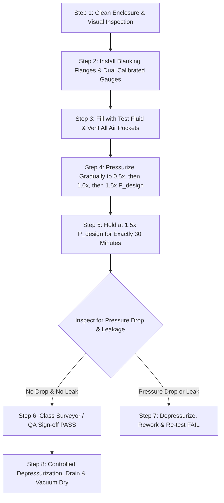

# VFCPL MARINE ENERGY PLATFORM (VFCPL-MEP-001)
## Standard Operating Procedure (SOP) & Quality Assurance Inspection Record
### Shop Hydrostatic Pressure Testing of Immersion Cooling Casing & Manifold

---

**Document ID:** VFCPL-MEP001-QA-SOP-004  
**Revision:** Rev 0  
**Effective Date:** 18 September 2026  
**Governing Standards:**
* **ABS Rules:** *Requirements for Use of Lithium-ion Batteries in Marine and Offshore Industries* (Dec 2025), Section 2/2.4 & Section 3/2 (Table 1).
* **IRS Rules:** *Classification Note on Approval of Lithium-ion Battery Systems* (CN Rev.1, Mar 2026), Section 5.2.d.viii & Appendix 1(b)#8.

---

## 1. Purpose & Scope

This Standard Operating Procedure (SOP) defines the mandatory shop hydrostatic pressure testing requirements for the **VFCPL-MEP-001** sealed aluminum immersion cooling enclosure, internal channels, pump interface flanges, and expansion bellows. 

This test verifies the structural pressure-withstanding integrity and leak-tightness of the fluid containment envelope prior to dielectric fluid filling, electrical integration, and final delivery.

---

## 2. Test Pressure & Acceptance Criteria

1. **Design Pressure ($P_{design}$):** Established per hydraulic design calculation (Nominal: $1.0\text{ bar gauge} \approx 100\text{ kPa}$).
2. **Shop Hydrostatic Test Pressure ($P_{test}$):**
   $$P_{test} = 1.5 \times P_{design} = 1.5\text{ bar gauge} \approx 150\text{ kPa}$$
3. **Mandatory Hold Duration:** Exactly **30 minutes minimum** under continuous pressure observation.
4. **Acceptance Criteria (Zero Tolerance):**
   * **Pressure Drop:** Zero measurable pressure drop ($\Delta P = 0$) over the 30-minute hold period (after thermal stabilization).
   * **Visual Seepage:** Zero liquid seepage, sweating, weeping, or gasket displacement across all weld seams, flange faces, fastener penetrations, and sight glasses.
   * **Permanent Deformation:** Zero plastic or permanent mechanical deformation of the enclosure walls after depressurization.

---

## 3. Test Equipment & Instrumentation

* **Test Medium:** Clean, filtered, demineralized water or compatible low-viscosity non-corrosive hydraulic test fluid.
* **Calibrated Pressure Gauges:** Two (2) independent calibrated pressure gauges connected to the test header (dual-gauge verification):
  * Gauge Range: 0 to 4.0 bar (test pressure lies between 30% and 70% of full scale).
  * Accuracy Class: Class 0.5 or better ($\pm 0.5\%$ full-scale accuracy).
  * Calibration Status: Valid calibration certificate within 6 months.
* **Hydrostatic Test Pump:** Hand-operated or variable-speed pneumatic/hydraulic test pump with fine-metering needle bleed valve.
* **Air Venting Valve:** Top-mounted bleed valve to ensure 100% expulsion of air pockets before pressurization.

---

## 4. Execution Step-by-Step Procedure



1. **Preparation:** Thoroughly clean the internal tank surfaces. Install blind flanges on all hydraulic ports and PRV interfaces using production gasket materials.
2. **Filling & Air Evacuation:** Fill the tank with test fluid through the bottom inlet while keeping the top bleed valve open until a continuous solid fluid stream emerges without air bubbles. Close the bleed valve.
3. **Gradual Pressurization:**
   * Step 3A: Raise pressure to $0.5 \times P_{design}$ (0.5 bar); hold for 5 minutes for initial joint settling.
   * Step 3B: Raise pressure to $1.0 \times P_{design}$ (1.0 bar); hold for 5 minutes; verify no flange distortion.
   * Step 3C: Raise pressure to $1.5 \times P_{design}$ (1.5 bar); isolate the pump valve.
4. **30-Minute Hold Period:** Start the calibrated timer. Monitor pressure continuously for 30 minutes. Conduct a systematic 360° visual inspection of all welds and seals.
5. **Surveyor Witnessing:** If witnessing is requested for Type Approval or Unit Certification, the attending IRS / ABS surveyor must witness the gauge readings at start ($t = 0\text{ min}$) and completion ($t = 30\text{ min}$).
6. **Drainage & Drying:** Depressurize gradually through the needle valve. Drain all fluid and apply heated vacuum drying to remove any trace moisture before dielectric oil introduction.

---

## 5. Official Hydrostatic QA Inspection Record Sheet

```
========================================================================================
VFCPL-MEP-001 IMMERSION CASING SHOP HYDROSTATIC TEST RECORD
========================================================================================
Unit Serial Number: ________________________   Assembly Drawing No: ____________________
Manufacturing Date: ________________________   Test Location: __________________________
Tank Material / Grade: Aluminum 5083-H111      Gasket Material: FKM / EPDM Shore A 70

INSTRUMENTATION DATA:
Gauge 1 Serial No: _________________________   Cal. Exp. Date: _________________________
Gauge 2 Serial No: _________________________   Cal. Exp. Date: _________________________
Test Medium: Demineralized Water [ ] Other: ________________ Fluid Temp: ____________ °C

PRESSURE & TIME LOG:
Calculated Design Pressure (P_design):          1.00 bar gauge (100 kPa)
Target Test Pressure (1.5 x P_design):          1.50 bar gauge (150 kPa)
Pressurization Start Time:                      ____ : ____
Pressure Stabilized at 1.50 bar Time (t = 0):   ____ : ____   Initial Pressure: _____ bar
Hold Completion Time (t = 30 min):              ____ : ____   Final Pressure:   _____ bar
Total Test Duration:                            30 MINUTES MINIMUM
Recorded Pressure Drop (Delta P):               _____ bar (Must be 0.00 bar)

VISUAL INSPECTION CHECKPOINTS (Mark OK / FAIL):
[ ] Circumferential & Longitudinal Weld Seams: No weeping, pinholes, or cracks.
[ ] Flange Interfaces & Gasket Compression:    No extrusion, seepage, or moisture.
[ ] Sight Glass / Optical Level Window:        No leakage or gasket displacement.
[ ] Casing Structural Shell & Top Cover:       No permanent deflection or distortion.
[ ] Sensor Port Penetrations (T1 - T6):        No thread seepage or weeping.

TEST RESULT:  [ ] PASSED (Conforms to ABS Sec 2/2.4 & IRS CN Rev.1 §5.2.d.viii)
              [ ] REJECTED (Corrective action required)

Corrective Action / Remarks: ___________________________________________________________
________________________________________________________________________________________

SIGN-OFF APPROVAL:
VFCPL QA Inspector Name:     ____________________   Signature: ____________  Date: _____
Clean Electric Tech Lead:    ____________________   Signature: ____________  Date: _____
IRS Attending Surveyor:      ____________________   Signature: ____________  Date: _____
ABS Attending Surveyor:      ____________________   Signature: ____________  Date: _____
========================================================================================
```
